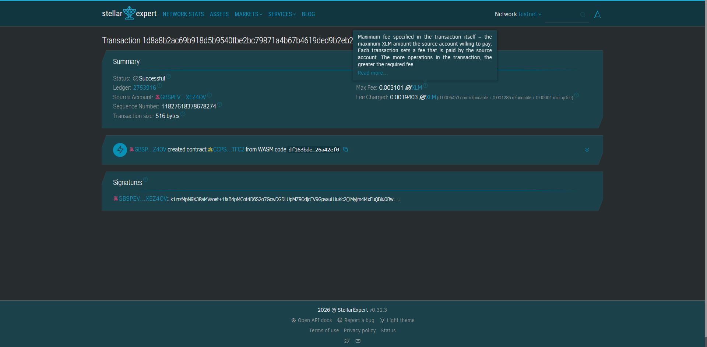

# SamaSama Pool


#CONTRACT ID: 
SAGS7EXRGKYFHOK5FGYUCIWWVAGCMS75ZK2LKH4NSNNMAZZ7T7QPFT2Q

#CONTRACT LINK: 
https://stellar.expert/explorer/testnet/tx/1d8a8b2ac69b918d5b9540fbe2bc79871a4b67b4619ded9b2eb29a0d280d8977




Trustless on-chain rotating savings and credit system (*paluwagan*) eliminating counterparty risks for community savers in the Philippines using Soroban smart contracts.

## Core Fundamentals
* **Problem:** Members of informal workplace savings circles face severe losses when early-draw winners default or managers mismanage cash.
* **Solution:** Automated escrow tracking mechanisms remove intermediaries, enforcing locked programmatic rotation cycles and automated token disbursements.
* **Timeline:** 4-Week Collaborative Bootcamp Prototype.
* **Stellar Integration Vector:** High-performance Soroban state architecture, native asset payment tracks, and deterministic authentication criteria.

## Vision and Purpose
To formalize community financial traditions across Southeast Asia, helping unbanked and underbanked professionals build secure financial standing through transparent peer-to-peer mechanisms.

## Prerequisites
* **Rust Toolchain:** `rustc 1.75.0+`
* **Soroban CLI Version:** `21.0.0+`
* **Target Architecture Configuration:** `wasm32-unknown-unknown`

## Build Directions
Compile the production-grade WebAssembly smart contract artifact:
```bash
soroban contract build
